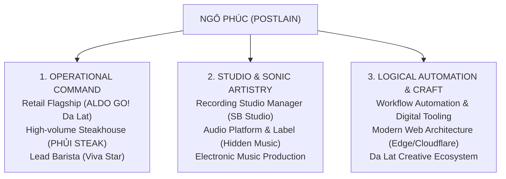

# POSTLAIN CV / PORTFOLIO
# FORENSIC AUDIT & CREATIVE RESET REPORT
**Document ID:** `AUDIT-POSTLAIN-2026-09-09`  
**Target Repository:** `postlainmusic/postlain_cv_portfolio`  
**Lead Evaluator:** Creative Director & System Architect (Antigravity AOS v3.0)  
**Status:** COMPLETE (Phase 0.5 Forensic Baseline)  
**Execution Constraint:** NO RUNTIME CODE CHANGES APPLIED

---

## 1. EXECUTIVE SUMMARY & FORENSIC DIAGNOSIS

The current iteration of the **POSTLAIN CV Portfolio** represents a classic failure mode of AI-assisted web development:
$$\text{PROMPT} \longrightarrow \text{PREMATURE IMPLEMENTATION} \longrightarrow \text{DECORATIVE EFFECT STACKING} \longrightarrow \text{SELF-DECLARED "DONE"}$$

### The Core Diagnosis
The website attempted to achieve "Awwwards prestige" by copying superficial visual tropes of futuristic web design:
1. **Rigid 100vh Slide-Deck Lockout:** Hijacked natural browser scrolling, wheel events, touch gestures, and selection.
2. **AI-Generated Cliché Aesthetic:** Monolithic pill buttons, rounded glass cards (`rounded-[2.5rem]`, `backdrop-blur-2xl`), cyan/lime ambient glow blobs, and decorative particle animations.
3. **Deceptive System Language:** Faked sci-fi terminal tags (`ACT 01 // OVERTURE`, `SPEC_SYS // 11°56'N 108°26'E`, `CORE_LOAD // 60FPS`, `EDGE_ONLINE // CLOUDFLARE`) that turned a real professional's career into a video game HUD mockup.
4. **Disconnected Sound Toy:** Implemented a Web Audio synthesizer and 8-bit drum sequencer (`SonicDeck.tsx`) that generates synthetic click bleeps instead of presenting Ngô Phúc's actual musical venture (**Hidden Music**).
5. **Alienation of Real Identity:** Ngô Phúc's genuine, compelling human narrative—an **operations leader who commands high-pressure retail flagships, steakhouse kitchen lines, and recording studio operations**, while simultaneously composing electronic music in Da Lat—was buried under layers of generic AI chrome.

**Creative Reset Directive:** The existing user interface is declared a **failed first draft**. It is NOT the design reference. The authentic biography, operational track record, Da Lat creative roots, and music production catalog are the sole source material.

---

## 2. STEP 1 · REPOSITORY FORENSICS (CLAIMS VS REALITY)

| System Domain | Claimed in Documentation / Handover | Actual State in Codebase | Forensic Verdict | File & Line Reference |
| :--- | :--- | :--- | :--- | :--- |
| **Frontend Stack** | React 18 + Vite 6 + TypeScript + Tailwind | React 18.3.1, Vite 6.1.0, TS 5.7.3, Tailwind 3.4.17 | **ACTUAL** | `package.json:29,56,57` |
| **State Store** | Zustand 5 global state management | Modular Zustand store (`usePortfolioStore.ts`) | **ACTUAL** | `src/frontend/stores/usePortfolioStore.ts` |
| **Edge API Backend** | Hono API Worker with MailChannels email dispatch | Hono 4.13.7 Worker handling `/api/health`, `/api/profile`, `/api/contact` | **ACTUAL** | `src/backend/worker.ts:1-142` |
| **Database / Drizzle** | Drizzle ORM + SQLite schema migrations | `src/db/schema.ts` defines tables, but is **never imported or queried** in `worker.ts` | **ORPHANED** | `src/db/schema.ts`, `src/backend/worker.ts` |
| **Storybook Docs** | Storybook component documentation | Storybook installed in `package.json`, but **0 stories exist** in `src/` | **MISSING** | `package.json:37-43` |
| **3D Rendering** | Cinematic 3D Scrollytelling Engine | `ScrollyScene3D.tsx` is an imperative 2D Canvas drawing rotating rings. `CareerTour3D.tsx` has **zero 3D math** (pure 2D card carousel). | **DECEPTIVE** | `src/frontend/components/ScrollyScene3D.tsx`, `CareerTour3D.tsx` |
| **Cursor System** | Interactive custom crosshair cursor | `CustomCursor.tsx` follows mouse via RAF; `global.css` forcibly disables OS cursor globally with `cursor: none !important;`. | **BROKEN UX** | `src/frontend/styles/global.css:30-33` |
| **Preloader** | Asset preloader | Dummy timer counting to 100% over 650ms; loads no actual assets. | **FAKE** | `src/frontend/components/CinematicPreloader.tsx` |
| **Sound Engine** | Cyber-acoustic sound engine | Procedural Web Audio synth playing sine/square bleeps on click; unrelated to real audio tracks. | **MISALIGNED** | `src/frontend/lib/audio.ts:1-449` |
| **Scroll Architecture** | 100vh Fullscreen Act Stage | `overflow: hidden; height: 100%;` with wheel interception and 600ms debounce. | **ACCESSIBILITY FAILURE** | `src/frontend/styles/global.css:9`, `src/frontend/App.tsx:58-85` |

---

## 3. STEP 2 · CURRENT PRODUCT AUDIT (20 DIMENSIONS)

### 1. Identity
- **What is wrong:** The site portrays Ngô Phúc as a generic sci-fi cyber-entity / fullstack engineer rather than an operations leader and music producer.
- **Why it is wrong:** Confuses recruiters and creative partners looking for authentic management and studio production capabilities.
- **Pattern:** Cyberpunk buzzword clustering.
- **Replacement:** Grounded editorial identity rooted in Da Lat, executive orchestration, and sonic artistry.

### 2. Positioning
- **What is wrong:** Claims simultaneously: "Store Manager", "Software Engineer & AI Automation", "Music Producer", "Senior Line Chef", "Executive Matrix".
- **Why it is wrong:** Jack-of-all-trades presentation dilutes authority.
- **Pattern:** Unfiltered CV keyword stacking.
- **Replacement:** Unified positioning: **The Orchestrator**—mastering complex physical workflows (retail/culinary), creative studios (SB Studio/Hidden Music), and modern digital automation.

### 3. Storytelling
- **What is wrong:** Story is fragmented into 5 isolated slide boxes.
- **Why it is wrong:** User experiences disjointed cards instead of an engaging narrative arc.
- **Pattern:** Slide-deck presentation disguised as a website.
- **Replacement:** Continuous, editorial scroll narrative with intentional typographic pacing.

### 4. Information Architecture
- **What is wrong:** 5 fixed Acts forced into 100vh viewports (`Hero`, `Career Tour`, `Hidden Music`, `Matrix & Education`, `Direct Dispatch`).
- **Why it is wrong:** Important secondary content (education, contact details, career highlights) is buried behind tabs and carousel buttons.
- **Pattern:** Modal/tab containment to fit artificial viewport constraints.
- **Replacement:** Hierarchy-driven layout with clear primary narrative sections, deep-dive project cases, and persistent contact access.

### 5. Navigation
- **What is wrong:** Hijacks standard mouse wheel, keyboard, and touch swipe with a 600ms debounce.
- **Why it is wrong:** Users cannot scroll at their own pace; skipping or rapid navigation feels sluggish and broken.
- **Pattern:** Wheel event hijacking (`preventDefault` + debounced state step).
- **Replacement:** Native browser scrolling with smooth anchor links and subtle sticky progress markers.

### 6. Content Hierarchy
- **What is wrong:** Visual noise (sparkles, glowing borders, badges) competes with career achievements.
- **Why it is wrong:** The eye has no resting place; text is low contrast or overshadowed by glowing containers.
- **Pattern:** Flat hierarchy compensated with decorative CSS effects.
- **Replacement:** Typographic scale hierarchy (72px/48px/24px/16px) with clean monochromatic contrast.

### 7. Typography
- **What is wrong:** Four disjointed font families (Montserrat, Cormorant Garamond, Space Grotesk, Plus Jakarta Sans) used simultaneously with inconsistent weights and casing.
- **Why it is wrong:** Creates typographical discord; serif italic feels out of place next to monospace HUD labels.
- **Pattern:** Font buffet without an editorial typographic grid.
- **Replacement:** A disciplined 2-font pairing: a distinctive, authored Display font (e.g. Montserrat or bespoke serif) + high-legibility Grotesque body font (Plus Jakarta Sans) with tabular numbers.

### 8. Layout
- **What is wrong:** Every section is a centered card box (`max-w-5xl`, `rounded-[2.5rem]`, `p-10`) floating in the center of the viewport.
- **Why it is wrong:** Monotonous rhythm; every act looks and feels structurally identical.
- **Pattern:** Symmetrical card container syndrome.
- **Replacement:** Dynamic asymmetric editorial grids, alternating full-width typography, multi-column storytelling, and spacious breathing room.

### 9. Visual Language
- **What is wrong:** Generic AI aesthetic: dark gray background (`#030305`), neon lime accents (`#a3e635`), glassmorphism (`backdrop-blur-2xl`), ambient radial glow blobs.
- **Why it is wrong:** Indistinguishable from hundreds of AI-generated portfolio templates.
- **Pattern:** Web3 / Cyberpunk boilerplate styling.
- **Replacement:** Refined, atmospheric editorial art direction inspired by Da Lat's mist, physical studio mixing consoles, and tactile brutalist typography.

### 10. Interaction Design
- **What is wrong:** Custom crosshair cursor, synthetic audio click feedback on every button, dragged rotation with inertia in orphaned components.
- **Why it is wrong:** Gimmicky interactions that frustrate rather than delight.
- **Pattern:** Interactive novelty for novelty's sake.
- **Replacement:** Micro-interactions that provide tactile feedback (smooth button state transitions, magnetic link pulls, subtle layout reveals).

### 11. Motion
- **What is wrong:** Rigid 700ms `translate3d` slide animations between acts, continuous spinning dashed borders, marquee ribbons.
- **Why it is wrong:** Induces visual fatigue; motion does not communicate meaning or spatial context.
- **Pattern:** Continuous ambient CSS animations.
- **Replacement:** Scroll-linked reveal motions, staggered typographic entrance, and smooth viewport transitions respecting `prefers-reduced-motion`.

### 12. 3D Usage
- **What is wrong:** Imperative 2D canvas drawing fake particle rings (`ScrollyScene3D.tsx`) with zero semantic connection to the content.
- **Why it is wrong:** Consumes CPU/GPU cycles without enhancing storytelling.
- **Pattern:** Gratuitous canvas background filler.
- **Replacement:** Purposeful 3D or high-definition visual assets (e.g., interactive soundwave visualizers, tactile physical artifacts, or curated imagery).

### 13. Audio Usage
- **What is wrong:** Real-time Web Audio synth (`audio.ts`) generating synthetic sine tones and drum pads.
- **Why it is wrong:** Demotes POSTLAIN's real music credentials to an 8-bit soundboard.
- **Pattern:** Procedural audio generator without content integration.
- **Replacement:** Embedded, opt-in audio player streaming real music tracks and sound design productions from Hidden Music.

### 14. Photography / Media
- **What is wrong:** Currently **zero** real photographs, studio images, or project screenshots exist in the repository.
- **Why it is wrong:** Without imagery, the portfolio feels synthetic and ungrounded.
- **Pattern:** Total reliance on CSS shapes and Lucide icons.
- **Replacement:** Editorial photography of Da Lat, recording studio setups, retail/culinary operations, and high-fidelity project captures.

### 15. Responsive Behavior
- **What is wrong:** 100vh lock causes content overflow and clipping on mobile screens and small laptop viewports.
- **Why it is wrong:** Mobile users cannot scroll down to see full career bullets or contact form submit buttons.
- **Pattern:** Desktop-first fixed viewport scaling.
- **Replacement:** Fluid mobile-first responsive document flow with natural touch scrolling.

### 16. Accessibility (WCAG AA)
- **What is wrong:** `cursor: none !important;` disables OS cursor; `user-select: none;` disables text copying; low-contrast zinc-500 text; missing ARIA attributes.
- **Why it is wrong:** Fails WCAG 2.1 AA criteria severely; completely unusable for screen readers and keyboard-only users.
- **Pattern:** Aesthetic overrides destroying accessibility primitives.
- **Replacement:** 100% native cursor support, selectable text, semantic HTML5 headings (`<h1>` through `<h3>`), accessible contrast ratios (>= 4.5:1), and keyboard focus rings.

### 17. Performance
- **What is wrong:** Constant `requestAnimationFrame` loops running canvas rendering and cursor lerping even when idle; `setInterval` running in preloader and health checks.
- **Why it is wrong:** Unnecessary battery drain and GPU thermal throttling on mobile devices.
- **Pattern:** Unthrottled render loops.
- **Replacement:** Static CSS transitions, IntersectionObserver-driven animations, and idle-paused canvas visualizers.

### 18. SEO & Social Metadata
- **What is wrong:** Basic meta tags in `index.html`; missing Open Graph images, Twitter card metadata, structured JSON-LD data (`Person`, `CreativeWork`).
- **Why it is wrong:** Poor link previews on LinkedIn, Zalo, Facebook, and Telegram; weak search engine indexing.
- **Pattern:** Default Vite HTML boilerplate.
- **Replacement:** Comprehensive OpenGraph tags, dynamic preview cards, JSON-LD Schema markup, and localized meta descriptions.

### 19. Technical Architecture
- **What is wrong:** Monolithic `App.tsx` (440 lines) handling clock state, act transitions, touch events, sound triggering, and presentation; orphaned components (`SpatialSpiral3D.tsx`, `EdgeDispatch.tsx`).
- **Why it is wrong:** High maintenance friction, tight coupling, hard to test or refactor.
- **Pattern:** Giant master component pattern.
- **Replacement:** Modular component architecture with clean separation of layout, feature sections, state stores, and utility hooks.

### 20. Maintainability
- **What is wrong:** Content is duplicated across `profile.ts`, `dictionary.ts`, `worker.ts`, and component files.
- **Why it is wrong:** Updating a job title or phone number requires editing 4 separate files.
- **Pattern:** Dispersed source of truth.
- **Replacement:** Single-source-of-truth content architecture under `src/frontend/content/` or structured JSON registry.

---

## 4. STEP 3 · AI-GENERATED AESTHETIC DETECTION & RULES

### Detected AI Cliché Patterns in Codebase

```
[❌ DETECTED] rounded-[2.5rem] on every container box
[❌ DETECTED] backdrop-blur-2xl with border-white/10 on every card
[❌ DETECTED] bg-[#a3e635]/10 rounded-full blur-[100px] ambient glow blobs
[❌ DETECTED] 01 // CHRONOLOGICAL CAREER TOUR HUD-style section labels
[❌ DETECTED] SPEC_SYS // 11°56'N 108°26'E fake corner brackets
[❌ DETECTED] Custom Crosshair Cursor tag popping (OPEN, TOUR, CALL, MAIL)
[❌ DETECTED] 0.65s fake preloader with spinning dashed gradient orb
[❌ DETECTED] 100vh wheel-hijacked slide deck
[❌ DETECTED] Monospace labels for non-code information
[❌ DETECTED] Sparkles icon spam on standard headers
```

### Future Anti-AI Aesthetic Rules (Mandatory System Constraints)

1. **NO HUD / Cyberpunk Framing:** Banish fake coordinates, fake system status badges, FPS monitors, and terminal-style brackets.
2. **NO Ubiquitous Glassmorphism:** Surfaces must have distinct, deliberate solid/semi-solid values. Background blur is restricted to floating sticky headers only.
3. **NO Ambient Color Glow Blobs:** Eliminating diffuse radial gradient blobs behind cards. Lighting must come from deliberate contrast and photographic composition.
4. **NO Pill-Shaped Container Overload:** Replace oversized pill capsules with clean geometric framing, horizontal rules, and whitespace.
5. **NO Artificial Preloaders:** If the page bundle is 150KB, it must render instantly upon initial paint without delay.
6. **NO Global Cursor Overrides:** The browser's native cursor must remain untouched.

---

## 5. STEP 4 · CONTENT FORENSICS & AUTHENTIC HUMAN CORE

### Extracting the Authentic Human Narrative
Ngô Phúc (POSTLAIN) is NOT an AI persona or a generic web developer. The actual human story has three powerful pillars:



### Content Value Classification

- **High-Value Anchors (Preserve & Elevate):**
  - The Da Lat origin: creates atmospheric, sensory distinctiveness.
  - The operational breadth: managing inventory, VIP clients, artist releases, kitchen tickets, and retail sales teams.
  - The Hidden Music venture: actual digital platform with real audio output.
  - The personal motto: *"Quản lí bằng logic. Thổi hồn bằng nghệ thuật."*
- **Low-Value / Distracting Content (Remove / Reframe):**
  - "Software Engineer & AI Automation" subtitle: Reframe to "Workflow Automation & Digital Engineering".
  - Faked database/server ping statistics.
  - Artificial "Executive Matrix" corporate terminology.

---

## 6. STEP 5 · STORYTELLING ANALYSIS: 4 NARRATIVE DIRECTIONS

To ensure the redesign has an authored point of view rather than a generic template, we propose 4 distinct creative directions:

```
┌─────────────────────────────────────────────────────────────────────────────┐
│ DIRECTION 01 · THE STUDIO DISPATCH (Editorial Audio & Operations Chronicle) │
│ DIRECTION 02 · ORCHESTRATION IN HIGH CONTRAST (Tactile Swiss Brutalism)     │
│ DIRECTION 03 · THE DA LAT FREQUENCIES (Atmospheric Sonic Minimalism)       │
│ DIRECTION 04 · THE PRODUCTION LEDGER (Kinetic Industrial Modernism)         │
└─────────────────────────────────────────────────────────────────────────────┘
```

---

### DIRECTION 01: THE STUDIO DISPATCH
*Editorial Audio & Operations Chronicle*

- **Core Idea:** A high-end editorial magazine / studio dispatch that documents the intersection of physical operations, recording studio direction, and sound production.
- **Emotional Tone:** Sophisticated, rhythmic, tactile, grounded, and deeply human.
- **Narrative Structure:** 
  1. *Cover Page:* High-impact typography, Da Lat timestamp, direct introduction.
  2. *The Editorial Essay / Philosophy:* Why operational logic and musical artistry share the same foundation.
  3. *The Record (Timeline):* Chronological career case studies formatted as rich editorial columns with tangible responsibilities.
  4. *The Studio Feature:* Hidden Music deep dive with embedded audio player and release catalog.
  5. *The Direct Line:* Elegant contact dispatch.
- **Visual Language:** Monochromatic editorial layout (deep charcoal `#0e1015`, warm parchment paper `#f4f3ee`, crisp ivory `#ffffff`), sophisticated serif typography paired with a clean grotesque font, 1px hairline rules, zero neon glows.
- **Interaction Language:** Smooth vertical momentum scrolling, subtle paragraph highlight reveals, interactive vinyl/audio track preview player.
- **What It Avoids:** Sci-fi HUDs, pill cards, neon glows, full-screen slide lockouts.
- **Risks:** Requires strong copywriting and typography discipline to prevent feeling like a static blog.
- **Mobile Ergonomics:** Perfect fit for mobile vertical reading.

---

### DIRECTION 02: ORCHESTRATION IN HIGH CONTRAST
*Tactile Swiss Brutalism & Kinetic Precision*

- **Core Idea:** Presenting Ngô Phúc as the master orchestrator of complex systems—whether managing a flagship retail floor, directing a recording studio session, or expediting a steakhouse line.
- **Emotional Tone:** Confident, structured, ultra-precise, authoritative, and energetic.
- **Narrative Structure:**
  1. *The Manifesto:* Large-scale kinetic typographic header: *"STRUCTURED BY LOGIC. DRIVEN BY SOUND."*
  2. *Three Operational Pillars:* Interactive three-column structural split: Retail Leadership | Studio Direction | Culinary Operations.
  3. *Case Archives:* Detailed breakdown of milestones, inventory scales, and team leadership.
  4. *Hidden Music Project:* High-contrast black-and-white visualizer and platform portal.
  5. *Initiate Contact:* Minimalist high-impact contact station with 1-click hotline and email dispatch.
- **Visual Language:** High-contrast Swiss design (pure deep black `#050505`, brilliant stark white `#ffffff`, international orange `#ff4400` or electric acid lime `#c6ff00` strictly as a 1% accent), heavy grotesque display fonts, stark asymmetric grid borders.
- **Interaction Language:** Crisp, snappy hover states (150ms), magnetic buttons, typography that subtly expands on interaction, interactive tabular data drawers.
- **What It Avoids:** Blurry glassmorphism, floating particle spheres, fake preloader orbs.
- **Risks:** Can feel cold if not balanced with rich personal narrative and warm audio samples.
- **Mobile Ergonomics:** High legibility, crisp tap targets, fast rendering.

---

### DIRECTION 03: THE DA LAT FREQUENCIES
*Atmospheric Sonic Minimalism*

- **Core Idea:** Grounding the portfolio in the sensory mood of Da Lat—fog, timber, studio consoles at night, focused solitary composition, and deliberate rhythm.
- **Emotional Tone:** Atmospheric, cinematic, introspective, artisanal, and refined.
- **Narrative Structure:**
  1. *Atmospheric Overture:* Soft ambient background texture (subtle mist grain), quiet typography, Da Lat weather/time ambient counter.
  2. *The Journey (Linear Flow):* Step-by-step evolution from early barista shifts to studio management, gastronomy, and retail leadership.
  3. *Sound & Acoustics (Hidden Music):* The central artistic centerpiece—listening room with real waveform visualizer and streaming tracks.
  4. *Executive Synthesis:* Strengths, multilingual capability, education background.
  5. *Direct Dialogue:* Soft-lit contact terminal.
- **Visual Language:** Muted nocturnal palette (deep slate pine `#0a0e14`, mist gray `#8892b0`, warm amber candle `#f59e0b`), organic typography pairing (classic editorial serif + clean geometric sans), subtle film grain overlay.
- **Interaction Language:** Ambient audio player with volume fader, smooth parallax on imagery, gentle staggered card transitions.
- **What It Avoids:** Neon cyber cliches, abrasive sounds, rigid 100vh lockouts.
- **Risks:** Relies heavily on high-quality audio and visual assets to carry mood.
- **Mobile Ergonomics:** Smooth scroll with ambient audio player docking to the bottom of the screen.

---

### DIRECTION 04: THE PRODUCTION LEDGER
*Kinetic Industrial Modernism*

- **Core Idea:** Treating the portfolio as a transparent "Production Ledger" of real work, operational throughput, and musical releases.
- **Emotional Tone:** Industrial, authentic, transparent, direct, and pragmatic.
- **Narrative Structure:**
  1. *Header Index:* Clean directory layout listing all sections with direct jump anchors.
  2. *Section 01 // Operations Ledger:* Structured tabular view of retail management, kitchen line management, and studio operations with expandable logs.
  3. *Section 02 // Audio Production:* Release catalog, track details, BPM/key metadata, streaming links.
  4. *Section 03 // Tooling & Automation:* Systems built (Hono APIs, Cloudflare edge scripts, inventory workflows).
  5. *Section 04 // Transmission:* Direct contact channel.
- **Visual Language:** Technical industrial aesthetic (slate charcoal `#12151c`, blueprint grid lines, technical tabular typography, subtle monochromatic badges).
- **Interaction Language:** Expandable data rows, quick-filter tags, audio waveform scrubber, instant keyboard shortcuts (`1-4`).
- **What It Avoids:** Sci-fi fake HUD elements (replaces them with real tabular project data).
- **Risks:** If unrefined, can look too much like developer documentation. Needs strong art direction to elevate it to Awwwards tier.
- **Mobile Ergonomics:** Responsive collapsibles and swipeable data tables.

---

## 7. STEP 6 · INFORMATION ARCHITECTURE RESET

### Architectural Comparison & Decision

| Architectural Model | Suitability for POSTLAIN | Verdict | Rationale |
| :--- | :--- | :--- | :--- |
| **Current: 100vh Fullscreen Act Lock** | Poor (3/10) | **REJECTED** | Destroys natural scroll physics, breaks mobile viewports, hides secondary information. |
| **Continuous Vertical Narrative** | Excellent (9/10) | **RECOMMENDED** | Natural scroll, seamless mobile responsiveness, allows variable section heights based on content weight. |
| **Hybrid Continuous + Sticky Focal Chapters** | Superior (10/10) | **RECOMMENDED (TOP CANDIDATE)** | Continuous vertical document flow, but with smooth sticky progress tracking and pinned audio player. |
| **Horizontal Side-Scroll** | Moderate (5/10) | **REJECTED** | Disorienting on trackpads and mobile touch devices; poor for long-form career text. |

### Recommended Information Architecture (Continuous Hybrid Model)

```
┌─────────────────────────────────────────────────────────────┐
│ 00. GLOBAL HEADER (Authored Mark • Da Lat Clock • Audio Nav) │
├─────────────────────────────────────────────────────────────┤
│ 01. THE INTRODUCTION (Identity • Philosophy • Direct Bio)   │
├─────────────────────────────────────────────────────────────┤
│ 02. THE OPERATIONAL RECORD (2019-2026 Chronological Tour)   │
│     - ALDO Retail Management (Flagship)                     │
│     - PHỦI STEAK Culinary Lead & Chef                       │
│     - SB Studio Recording Studio Direction                  │
│     - Viva Star Lead Barista                                │
├─────────────────────────────────────────────────────────────┤
│ 03. THE CREATIVE VENTURE: HIDDEN MUSIC (Audio Showcase)     │
│     - Real Audio Streaming Player                           │
│     - Studio Production & MCN Ecosystem                     │
├─────────────────────────────────────────────────────────────┤
│ 04. CAPABILITIES & ACADEMIC FOUNDATION                      │
│     - Operations / Automation / Creative Pillars            │
│     - Education (THPT, Van Lang PR, FPT Web Design)         │
├─────────────────────────────────────────────────────────────┤
│ 05. DIRECT INITIATION & CONTACT (Hotline • Email Dispatch)  │
├─────────────────────────────────────────────────────────────┤
│ 06. FOOTER (Colophon • Tech Stack • Real Legal/Social)       │
└─────────────────────────────────────────────────────────────┘
```

---

## 8. STEP 7 · AWWWARDS-LEVEL BENCHMARKING (PRINCIPLES VS COPYING)

When studying Site of the Year and Site of the Day award winners (e.g. `pacomepertant.com`, `forms.world`, `antonin-waterkeyn.com`, `basement.studio`, `kuon.space`), the differentiating factor is **editorial restraint and craftsmanship**, not effect density:

1. **Typographic Rhythm & Proportional Tension:** Masterful contrast between enormous, tight-kerning display titles and comfortable, generous body copy.
2. **Smooth Spatial Physics (Not Interception):** Smooth scrolling libraries (e.g. Lenis) are used to enhance natural inertia, NEVER to trap the user in rigid slides.
3. **Intentional Palettes:** Restricting the palette to 2-3 core tones with rich contrast, rather than multi-color gradients and glowing halos.
4. **Authentic Artifacts:** Award-winning sites showcase real artifacts—real photos, real music, real client deliverables, real code snippets—rather than generic abstract 3D spheres.
5. **Acoustic Subtlety:** Audio on high-end sites is either ambient, cinematic, or a dedicated listening player—never loud click bleeps on hover.

---

## 9. STEP 8 · DESIGN DELETION TEST

| Current Component / Asset | Verdict | Forensic Justification | Action Required |
| :--- | :--- | :--- | :--- |
| `CinematicPreloader.tsx` | **REMOVE** | Artificial 650ms timer with fake spinning orb; adds delay without loading assets. | Delete completely. Replace with instant SSR/client hydration. |
| `CustomCursor.tsx` | **REMOVE** | Overrides native OS cursor globally with laggy lerp; breaks accessibility and text selection. | Delete completely. Return to native cursor. |
| `ViewfinderFrame.tsx` | **REMOVE** | Fake sci-fi HUD frame with bogus GPS coordinates and FPS counter. | Delete completely. |
| `ScrollyScene3D.tsx` | **REMOVE** | Imperative canvas particle sphere that runs continuous RAF loop with no storytelling purpose. | Delete completely. Replace with intentional visual assets. |
| `SpatialSpiral3D.tsx` | **REMOVE** | Orphaned 3D drag carousel; complex math for unreadable floating cards. | Delete completely. |
| `SonicDeck.tsx` | **REPLACE** | 8-bit synthetic toy soundboard with kick/snare pads. | Replace with genuine Hidden Music streaming audio player. |
| `EdgeDispatch.tsx` | **REMOVE** | Duplicate contact form with fake server latency monitor. | Delete duplicate. |
| `CareerTour3D.tsx` | **REWORK** | Good career data, but wrapped in a generic glowing card box with deceptive "3D" name. | Rework into clean editorial timeline layout. |
| `MatrixAndEducation.tsx` | **REWORK** | Good content, but trapped in a claustrophobic tab box with glow blobs. | Rework into spacious typography-driven sections. |
| `DirectDispatch.tsx` | **REWORK** | Solid working Cloudflare Worker integration; needs clean editorial form styling. | Rework UI styling; keep Worker backend intact. |
| `src/frontend/lib/audio.ts` | **REPLACE** | 449-line Web Audio synthesizer playing click bleeps. | Replace with lightweight audio player controller for real tracks. |
| `src/frontend/styles/global.css` | **REFACTOR** | Contains `cursor: none !important;`, `overflow: hidden;`, and `user-select: none;`. | Purge all accessibility blockers and 100vh lockouts. |
| `src/frontend/stores/usePortfolioStore.ts` | **REFACTOR** | Contains sound blip triggers on every state transition and 100vh act navigation. | Simplify to pure UI state (locale, audio state, active section). |
| `src/backend/worker.ts` | **KEEP** | Clean Hono Worker with functional MailChannels contact dispatch. | Keep and maintain as backend API. |

---

## 10. STEP 9 · FUTURE DESIGN PRINCIPLES (10 CONCRETE RULES)

1. **Hierarchy Before Decoration:** Spatial rhythm, typography, and contrast must establish complete clarity before any visual embellishment is applied.
2. **Authentic Narrative Over Sci-Fi Futurism:** Represent Ngô Phúc as a real operations manager, studio director, and music producer from Da Lat.
3. **No Viewport Trapping:** Respect browser scroll physics, trackpad gestures, mobile address bars, and user zoom levels.
4. **Accessible by Default:** Full text selection, native OS cursor, WCAG AA contrast (>= 4.5:1), and keyboard navigation must be guaranteed.
5. **Real Music Over Synthetic Bleeps:** Audio integration must stream authentic tracks from Hidden Music with opt-in user control.
6. **Zero Fake Chrome:** Eliminate simulated coordinates, fake FPS counters, dummy preloaders, and mock server latency widgets.
7. **Semantic Color Discipline:** Accent color must be reserved for interactive actions or status signals, not sprayed as background glow.
8. **Mobile-First Ergonomics:** All touch targets must be >= 44x44px; layouts must reflow smoothly without squashed modals.
9. **Disciplined Typographic System:** Maximum 2 complementary font families with strictly controlled scales and line lengths (45-75ch).
10. **Bilingual Fidelity:** Vietnamese and English typography must be rendered with equal typographic craft and correct diacritics.

---

## 11. STEP 10 · TECHNICAL SURVIVAL AUDIT

| Technology | Verdict | Rationale & Evidence |
| :--- | :--- | :--- |
| **React 18 & TypeScript** | **KEEP** | Excellent component ecosystem, strict type safety, fast runtime. |
| **Vite 6** | **KEEP** | Sub-second HMR, optimized production builds, zero build bloat. |
| **Tailwind CSS 3.4** | **KEEP / REFACTOR** | Keep utility foundation; refactor `tailwind.config.js` to remove cliché color tokens and introduce refined editorial typography/color tokens. |
| **Zustand 5** | **KEEP** | Lightweight, zero-boilerplate state store. Ideal for locale, audio playback, and active navigation. |
| **Hono Framework** | **KEEP** | Excellent Edge API framework on Cloudflare Workers (`src/backend/worker.ts`). |
| **Zod Validation** | **KEEP** | Type-safe schema validation across Edge API boundaries. |
| **Cloudflare Pages & Workers** | **KEEP** | Global edge distribution, zero server maintenance, high reliability. |
| **Storybook** | **REFACTOR / ACTIVATE** | Currently installed but has 0 stories. Should be activated for isolating UI components before integration. |
| **Drizzle ORM** | **DEFER** | Currently unused in production API. Retain schema file for future dynamic database integration if needed, but do not bloat current phase. |
| **Custom Canvas 3D Engine** | **REMOVE** | Imperative 2D canvas fake-3D engines (`ScrollyScene3D`, `SpatialSpiral3D`) add CPU overhead without storytelling value. |
| **Web Audio Synthesizer** | **REPLACE** | Replace procedural click synthesizer with lightweight HTML5/WebAudio streaming player for Hidden Music audio files. |

---

## 12. STEP 11 · ARCHITECTURAL RISK RANKING

| Risk Factor | Severity | Description | Mitigation Strategy |
| :--- | :--- | :--- | :--- |
| **Monolithic App.tsx** | **CRITICAL** | `App.tsx` contains 440 lines coupling clock timer, wheel events, touch gestures, sound blips, act transitions, and layout. | Deconstruct into modular layout wrapper, header, section modules, and clean custom hooks. |
| **100vh Viewport Lockout** | **CRITICAL** | `overflow: hidden; height: 100%;` locks viewport and breaks mobile responsiveness. | Transition immediately to standard document flow with smooth scroll container. |
| **Global Cursor / Selection Hijacking** | **CRITICAL** | `global.css` has `cursor: none !important;` and `user-select: none;`. | Purge rules from `global.css` to restore native OS accessibility. |
| **Dispersed Content Architecture** | **HIGH** | Profile data split between `profile.ts`, `dictionary.ts`, and `worker.ts`. | Consolidate into single-source-of-truth content directory. |
| **Lack of Visual & Media Assets** | **HIGH** | Zero photography or real project screenshots in repository. | Curate and generate high-fidelity editorial visual assets and audio previews. |
| **Dormant Dependencies** | **MEDIUM** | Drizzle ORM and Storybook installed but not actively wired up. | Keep configuration clean; do not write speculative database code until required. |

---

## 13. STEP 12 · CREATIVE DIRECTOR VERDICT

### 1. What is fundamentally wrong?
The website attempted to look like an "Awwwards tech demo" by copying AI sci-fi clichés (hud brackets, fake coordinates, glowing blobs, rigid 100vh slides, custom cursor, fake preloader) while completely burying the authentic, compelling human story of Ngô Phúc: a multi-disciplinary operations leader in Da Lat who manages retail flagships, kitchens, recording studios, and creates electronic music.

### 2. What should be preserved?
- The verified biographical and career data (Viva Star, SB Studio, PHỦI STEAK, ALDO GO! Da Lat).
- The venture project: **Hidden Music** (`https://hiddenmusic.postlain.com`).
- The core philosophy: *"Quản lí bằng logic. Thổi hồn bằng nghệ thuật."*
- The Cloudflare Workers backend (`worker.ts`) and contact email dispatch pipeline.
- The core technical stack (React, TypeScript, Vite, Tailwind, Zustand, Hono, Zod).

### 3. What should be destroyed?
- The fake 0.65s preloader (`CinematicPreloader.tsx`).
- The global cursor hijacking and crosshair tags (`CustomCursor.tsx`).
- The fake HUD brackets and sci-fi tags (`ViewfinderFrame.tsx`).
- The imperative canvas particle sphere (`ScrollyScene3D.tsx`) and orphaned spiral (`SpatialSpiral3D.tsx`).
- The synthetic click bleep sound engine (`SonicDeck.tsx`, `audio.ts`).
- The duplicate contact widget with fake server ping (`EdgeDispatch.tsx`).
- The rigid 100vh viewport lock in `global.css` and `App.tsx`.

### 4. What should be redesigned from zero?
- **Layout Architecture:** Move to a fluid, continuous hybrid editorial scroll experience.
- **Visual Art Direction:** Monochromatic, high-contrast, atmospheric typography and layout inspired by Da Lat and recording studio craft.
- **Audio Experience:** An authentic, opt-in audio player that streams real music tracks and sound design from Hidden Music.
- **Career Presentation:** An editorial, chronological timeline showcasing operational complexity and leadership scale.

### 5. What should NOT be touched yet?
- Do NOT modify `src/` runtime application files yet.
- Do NOT install speculative npm dependencies.
- Do NOT start coding until the user selects and approves the creative direction (Directions 01 through 04).

### 6. What is the strongest creative opportunity?
The powerful contrast between **rigorous operational leadership** (managing fast-paced kitchens, retail teams, studio logistics) and **electronic music artistry in Da Lat**. This duality—logic and art—is unique, authentic, and immediately separates POSTLAIN from thousands of cookie-cutter portfolios.

### 7. What is the biggest creative risk?
Swapping one generic aesthetic for another (e.g. trading generic cyberpunk for generic minimalist portfolio). The design must feel distinctly **authored**, with intentional typography, deep contrast, atmospheric Da Lat texture, and authentic audio integration.

### 8. What should the next phase solve?
Phase 1 must:
1. Align with the user on the chosen creative direction (Direction 01: *The Studio Dispatch*, Direction 02: *Orchestration in High Contrast*, Direction 03: *The Da Lat Frequencies*, or Direction 04: *The Production Ledger*).
2. Establish the exact typography, color palette tokens, and content structure for the chosen direction.
3. Plan the modular deconstruction of `App.tsx` and replacement of deleted components without touching runtime code prematurely.

---

## 14. AUDIT ARTIFACTS INVENTORY

The following knowledge bases and governance files have been created in `.agents/knowledge/` to serve as immutable constraints for all subsequent phases:

- [CONTENT_FACTS.md](file:///c:/Users/Admin/Documents/GitHub/postlain_cv_portfolio/.agents/knowledge/CONTENT_FACTS.md) — Layer 1 Verified Biographical & Career Facts
- [ARCHITECTURE_FACTS.md](file:///c:/Users/Admin/Documents/GitHub/postlain_cv_portfolio/.agents/knowledge/ARCHITECTURE_FACTS.md) — Layer 1 Architecture & Dependency Forensics
- [KNOWN_FAILURES.md](file:///c:/Users/Admin/Documents/GitHub/postlain_cv_portfolio/.agents/knowledge/KNOWN_FAILURES.md) — Layer 4 Anti-Patterns & Banned Failures
- [DESIGN_PRINCIPLES.md](file:///c:/Users/Admin/Documents/GitHub/postlain_cv_portfolio/.agents/knowledge/DESIGN_PRINCIPLES.md) — Layer 3 Design Governance & Anti-AI Aesthetic Rules
- [ASSUMPTIONS.md](file:///c:/Users/Admin/Documents/GitHub/postlain_cv_portfolio/.agents/knowledge/ASSUMPTIONS.md) — Layer 2 Classified Assumption Registry
