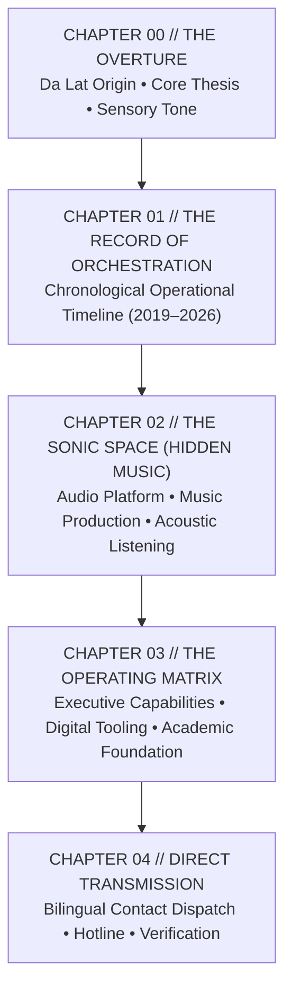

# POSTLAIN / THE OPERATING FREQUENCY
# PHASE 1 · CREATIVE ALIGNMENT, NARRATIVE ARCHITECTURE & CONTENT SPECIFICATION
**Document ID:** `PHASE-1-ALIGNMENT-2026-09-09`  
**Concept:** *POSTLAIN / THE OPERATING FREQUENCY*  
**Core Motif:** *The Art of Orchestration across Physical Systems & Sonic Space*  
**Status:** APPROVED ARCHITECTURAL & CONTENT SPECIFICATION  
**Execution Constraint:** NO RUNTIME CODE CHANGES APPLIED

---

## 1. STEP 1 · NARRATIVE THESIS

> **POSTLAIN (Ngô Phúc) operates at the convergence of two demanding worlds: the intense, high-stakes choreography of physical operations—managing international retail flagships, high-volume culinary lines, and commercial recording studios—and the disciplined, atmospheric realm of electronic music production in Da Lat.**
> 
> **These are not separate identities; they are expressions of a single core mastery: ORCHESTRATION.**
> 
> **Whether directing a multi-station kitchen line during peak dinner service, maintaining inventory precision across a luxury retail floor, or arranging multi-track frequency balance in a studio control room, the principle remains constant: aligning people, constraints, time, and materials into flawless rhythm. Led by logic. Elevated by art.**

*(Word count: 112 words)*

---

## 2. STEP 2 · NARRATIVE ARC

The experience abandons the rigid, 100vh locked 5-act slide-deck in favor of a **Continuous Editorial Hybrid Narrative** with fluid vertical rhythm, sticky chapter markers, and progressive identity disclosure.



---

### CHAPTER 00 // THE OVERTURE (The Frequency & The Man)
* **Purpose:** Establish immediate artistic authority, geographic grounding in Da Lat, and the central thesis of *Orchestration* within 5 seconds without gimmicks.
* **Content:**
  * Master Monogram & Typographic Mark: `NGÔ PHÚC // POSTLAIN`.
  * Geographic & Temporal Anchor: Da Lat GMT+7 Live Clock & coordinates (`11°56'N 108°26'E` presented strictly as clean editorial metadata, not a sci-fi HUD).
  * The Core Thesis Statement: *"Quản lí bằng logic. Thổi hồn bằng nghệ thuật."* (*"Led by logic. Elevated by art."*).
  * Direct Status: *"Operations Leadership & Studio Direction • 2026"*.
  * Secondary summary: Operations Manager, Studio Director & Sound Producer.
* **Emotional State:** Intrigued, grounded, calm, sensing high craftsmanship and intentional restraint.
* **Visual Behavior:** Expansive typographic scale with deep charcoal background (`#0b0d12`), warm ivory text (`#f8fafc`), sharp hairline structural dividers, generous negative space.
* **Motion Behavior:** Gentle staggered typographic fade-up on entry (350ms, ease-out); static once loaded. Zero looping spinners or particle clouds.
* **Interaction:** Unobtrusive sound player toggle in header; direct scroll indicator.
* **Exit / Transition:** Smooth vertical flow into Chapter 01 as the header gracefully condenses into a subtle sticky top masthead.

---

### CHAPTER 01 // THE RECORD OF ORCHESTRATION (The Physical World)
* **Purpose:** Present the verified operational career history with muscular credibility, narrative depth, and chronological clarity (2019 $\rightarrow$ 2026).
* **Content:**
  * Section Header: `THE RECORD OF ORCHESTRATION // 2019 — 2026`.
  * Contextual lead-in: *"Mastering the pressure points of physical workflows: inventory systems, high-volume kitchen lines, recording session logistics, and retail store leadership."*
  * **Chrono Node 01 (2019–2020):** *Viva Star Coffee* — Lead Barista & Shift Lead (Standardized F&B chain logistics).
  * **Chrono Node 02 (2023–2024):** *Công Ty TNHH SB Studio* — Recording Studio Manager & Artist Operations (Talent coordination, MCN partnerships, studio budget, release pacing).
  * **Chrono Node 03 (10/2024–02/2025):** *PHỦI STEAK Đà Lạt* — Kitchen Shift Lead / Supervisor (High-volume culinary coordination, European gastronomy, line gap coverage).
  * **Chrono Node 04 (02/2025–06/2025):** *PHỦI STEAK Đà Lạt* — Senior Line Chef (Steakhouse mastery, raw ingredient inventory, food safety precision).
  * **Chrono Node 05 (06/2025–07/2026):** *ALDO Flagship (GO! Đà Lạt)* — Store General Manager (Full luxury retail operations, inventory threshold management, sales team coaching).
* **Emotional State:** Impressed by authentic grit, high accountability under real-world pressure, and versatility.
* **Visual Behavior:** Multi-column asymmetric editorial timeline. Left column: Year & role metadata with tabular numbers. Right column: Impact narrative, key responsibilities, and operational scope.
* **Motion Behavior:** Subtle scroll-linked paragraph emphasis (opacity shift from `0.4` to `1.0` as each milestone enters viewport center).
* **Interaction:** Clickable milestone expansion for deep operational logs; hover highlights on role metadata.
* **Exit / Transition:** Vertical progression into the creative counterpart: Chapter 02.

---

### CHAPTER 02 // THE SONIC SPACE (The Creative World: Hidden Music)
* **Purpose:** Introduce the musical and acoustic dimension of POSTLAIN as a serious, professional creative venture (**Hidden Music**), not an amateur hobby or 8-bit sound toy.
* **Content:**
  * Section Header: `THE SONIC SPACE // HIDDEN MUSIC`.
  * Subtitle: *"Digital Sound Platform, Audio Engineering & Artist Network"*.
  * Venture Overview: `https://hiddenmusic.postlain.com` founded and operated by Ngô Phúc.
  * Three Creative Pillars:
    1. *Acoustic Engineering & Production:* High-fidelity sound design, mixing, and arrangement.
    2. *Artist & Copyright Governance:* MCN media networks, talent contracts, and IP management.
    3. *Automated Release Pipelines:* Digital distribution pipelines and audio streaming infrastructure.
  * **The Listening Room (Future Asset Bridge):** Embedded, minimalist streaming audio player for real musical releases (with graceful typography fallback until audio streams are linked).
* **Emotional State:** Surprised by the creative depth; recognizing that the same discipline governing retail/kitchen logistics powers music engineering.
* **Visual Behavior:** Deeper nocturnal tone shift (`#07080b`), subtle warm amber accent line (`#e2b714`), tactile waveform grid, external portal link to `hiddenmusic.postlain.com`.
* **Motion Behavior:** Audio visualizer bars (when playing, throttled to 30fps) reacting smoothly; gentle hover expansion on platform cards.
* **Interaction:** Play/Pause real audio stream, volume control, track selector, direct platform launch.
* **Exit / Transition:** Seamless descent into Chapter 03.

---

### CHAPTER 03 // THE OPERATING MATRIX & FOUNDATION
* **Purpose:** Synthesize capabilities, workflow automation, bilingual proficiency, and academic foundation into a cohesive executive profile.
* **Content:**
  * Section Header: `THE OPERATING MATRIX // CAPABILITIES & FOUNDATION`.
  * **Pillar A — Executive Management:** Cross-functional leadership, inventory & budget control, crisis management, team morale.
  * **Pillar B — Workflow & Digital Tooling:** Modern web architecture (React, TypeScript, Hono, Cloudflare Edge, Drizzle), LLM & automation scripts, internal tooling.
  * **Pillar C — Creative Direction & Communication:** Audio production, visual brand curation, fluent bilingual communication (Vietnamese/English).
  * **Academic Foundation:**
    * *2020:* Tốt nghiệp THPT (12/12).
    * *2021:* Đại học Văn Lang — Chuyên ngành Quan hệ Công chúng (PR) — *Bảo lưu*.
    * *2021:* Cao đẳng FPT Polytechnic — Chuyên ngành Thiết kế Web & Digital Media — *Bảo lưu*.
* **Emotional State:** Reassured of comprehensive competence, analytical clarity, and structural honesty.
* **Visual Behavior:** Clean 3-column capability grid followed by a balanced 2-column academic ledger with muted status tags.
* **Motion Behavior:** Staggered card entrance on viewport entry.
* **Interaction:** Interactive tab/filter toggling between Operational vs Technical vs Creative competencies.
* **Exit / Transition:** Clear downward guidance to Chapter 04 (The Call to Action).

---

### CHAPTER 04 // DIRECT TRANSMISSION (Initiation & Contact)
* **Purpose:** Provide an authoritative, friction-free mechanism for hiring managers, retail executives, studio partners, and creative collaborators to establish immediate contact.
* **Content:**
  * Section Header: `DIRECT TRANSMISSION // INITIATE DIALOGUE`.
  * Primary Proposition: *"Available for Store & Operations Management, Recording Studio Direction, and High-Impact Audio/Media Productions."*
  * **1-Touch Hotline Card:** `0938-649-420` (Instant call on mobile, 1-click clipboard copy on desktop with visual confirmation).
  * **Direct Email Card:** `studionopu@gmail.com` (Direct mailto + 1-click copy).
  * **Edge Contact Dispatch Form:** Clean 3-field form (Name, Email, Message) connected to the Cloudflare Worker MailChannels backend.
  * Location Anchor: `Kim Đồng, Phường 6, Đà Lạt, Lâm Đồng, Vietnam`.
* **Emotional State:** Eager to connect; feeling that reaching out is effortless, professional, and reliable.
* **Visual Behavior:** High-contrast focal container, crisp input underlines, prominent action button with tactile hover feedback.
* **Motion Behavior:** Smooth button hover depression (150ms), elegant form submission state transition (Sending $\rightarrow$ Success).
* **Interaction:** Direct typing, 1-click copy, instant hotline dial, form submission with real error handling.
* **Exit / Transition:** Clean colophon footer displaying build metadata, copyright, and bilingual toggle.

---

## 3. STEP 3 · INFORMATION ARCHITECTURE

```
PRIMARY NARRATIVE LAYER (Main Scroll Document)
│
├── 00. GLOBAL HEADER
│   ├── Authored Monogram: NGÔ PHÚC // POSTLAIN
│   ├── Da Lat Live Clock (GMT+7)
│   ├── Section Anchor Navigation
│   ├── Bilingual Switcher (VI / EN)
│   └── Audio Ambient Player Toggle
│
├── 01. CHAPTER 00: THE OVERTURE
│   ├── Display Identity
│   ├── Core Philosophy: "Quản lí bằng logic. Thổi hồn bằng nghệ thuật."
│   ├── Current Availability Status (2026)
│   └── Rapid Executive Summary
│
├── 02. CHAPTER 01: THE RECORD OF ORCHESTRATION
│   ├── Chronological Timeline (2019 → 2026)
│   ├── Retail Leadership (ALDO GO! Da Lat)
│   ├── Culinary Shift Leadership (PHỦI STEAK)
│   ├── Recording Studio Management (SB Studio)
│   └── F&B Chain Logistics (Viva Star)
│
├── 03. CHAPTER 02: THE SONIC SPACE (HIDDEN MUSIC)
│   ├── Venture Showcase (hiddenmusic.postlain.com)
│   ├── Audio Production & Acoustic Engineering
│   ├── Artist & MCN Copyright Governance
│   └── The Listening Room (Embedded Audio Player)
│
├── 04. CHAPTER 03: THE OPERATING MATRIX
│   ├── Core Capability Pillars (Operations, Tooling, Creative)
│   └── Academic Foundation (THPT 12/12, Van Lang PR, FPT Web Design)
│
├── 05. CHAPTER 04: DIRECT TRANSMISSION
│   ├── Direct Contact Hotline (0938-649-420)
│   ├── Primary Email (studionopu@gmail.com)
│   └── Edge Email Dispatch Form (Cloudflare Workers API)
│
└── 06. COLOPHON & SYSTEM FOOTER
    ├── Da Lat Location Coordinates
    ├── Architecture & Tech Stack Details
    └── Copyright & Year

SECONDARY / DETAIL LAYERS (Modals / Drawers / Deep Links)
├── Deep Operational Case Detail Drawers (Expandable on demand)
├── Hidden Music External Portal (https://hiddenmusic.postlain.com)
└── Academic Verification Notes (Status & transcripts summary)
```

---

## 4. STEP 4 · CONTENT HIERARCHY

| Classification | Items / Content Elements | Editorial Strategy |
| :--- | :--- | :--- |
| **PRIMARY** | Name (*Ngô Phúc / POSTLAIN*), Da Lat location, Core Philosophy, ALDO Store Management, SB Studio Direction, PHỦI STEAK Culinary Lead, Hidden Music platform, Hotline (`0938-649-420`), Email (`studionopu@gmail.com`). | Large display typography, high-contrast focal placement, direct interactive buttons. |
| **SECONDARY** | Viva Star Barista Lead, Academic history (THPT, Van Lang PR, FPT Web Design), Capabilities matrix, Edge contact form. | Structured grid columns, clear subheaders, readable body text. |
| **SUPPORTING** | GMT+7 Da Lat Clock, bilingual Vietnamese/English labels, technology stack colophon, software tooling details. | Compact tabular numbers, quiet metadata font, subtle border alignment. |
| **OPTIONAL** | Audio ambient playback, expandable case study sub-bullets. | User-initiated, non-intrusive. |
| **REMOVE** | Fake sci-fi brackets (`SPEC_SYS`), fake FPS counters, 0.65s dummy preloader, custom cursor override, fake server ping widget (`EdgeDispatch.tsx`), synthetic 8-bit drum pads (`SonicDeck.tsx`). | Completely purge from source code. |
| **NEEDS VERIFICATION** | Direct streaming audio MP3/AAC URLs for Hidden Music releases, professional portrait photography or studio workspace imagery. | Use clean typographic / generative material fallback until assets are supplied. |

---

## 5. STEP 5 · EXPERIENCE MODEL (TIME-BASED PSYCHOLOGY)

```
┌─────────────┬─────────────────────────────────┬───────────────────────────────┬───────────────────────────────┬─────────────────────────────┐
│ TIME ELAPSED│ WHAT THE USER SEES              │ WHAT THEY UNDERSTAND          │ WHAT THEY FEEL                │ WHAT THEY CAN DO            │
├─────────────┼─────────────────────────────────┼───────────────────────────────┼───────────────────────────────┼─────────────────────────────┤
│ 0 - 5 SEC   │ Crisp editorial masthead,       │ "This is Ngô Phúc (POSTLAIN),  │ Grounded, calm, impressed by  │ Read thesis, switch locale, │
│             │ Da Lat GMT+7 clock, bold thesis:│ an operations manager and     │ typographic restraint; no     │ toggle sound, begin scroll. │
│             │ "Logic & Art", 2026 status.     │ music producer in Da Lat."    │ visual clutter or AI tricks.  │                             │
├─────────────┼─────────────────────────────────┼───────────────────────────────┼───────────────────────────────┼─────────────────────────────┤
│ 5 - 15 SEC  │ The Record of Orchestration:    │ "He has real, high-stress     │ Respect for authentic grit;   │ Click milestone to expand   │
│             │ ALDO retail store manager,      │ physical leadership track     │ sees that he manages teams    │ detailed operational logs.  │
│             │ PHỦI STEAK line, SB Studio.     │ record across diverse spaces."│ and inventory rigorously."    │                             │
├─────────────┼─────────────────────────────────┼───────────────────────────────┼───────────────────────────────┼─────────────────────────────┤
│ 15 - 30 SEC │ The Sonic Space (Hidden Music): │ "His creative music work is   │ Intrigued by the duality;     │ Listen to audio track,      │
│             │ audio ecosystem, label, audio   │ a real platform, not an       │ recognizes high artistic      │ click to visit              │
│             │ player, acoustic engineering.   │ amateur hobby."               │ execution.                    │ hiddenmusic.postlain.com.   │
├─────────────┼─────────────────────────────────┼───────────────────────────────┼───────────────────────────────┼─────────────────────────────┤
│ 30 - 60 SEC │ Capabilities Matrix + Education:│ "He combines operations, web  │ Reassured of complete         │ Filter capabilities,        │
│             │ PR background, Web design,      │ tooling, creative direction,  │ competence and transparent    │ review educational path.    │
│             │ workflow automation.            │ and bilingual fluency."       │ background."                  │                             │
├─────────────┼─────────────────────────────────┼───────────────────────────────┼───────────────────────────────┼─────────────────────────────┤
│ 1 - 2 MIN   │ Direct Transmission Station:    │ "He is available for hire in  │ Ready to initiate contact;    │ Tap hotline to call, copy   │
│             │ 1-click hotline, email, edge    │ 2026 with immediate, zero-    │ confidence in professional    │ email, or dispatch message  │
│             │ contact dispatch form.          │ friction contact access."     │ responsiveness.               │ directly via form.          │
└─────────────┴─────────────────────────────────┴───────────────────────────────┴───────────────────────────────┴─────────────────────────────┘
```

---

## 6. STEP 6 · NAVIGATION PHILOSOPHY

### 1. The Editorial Navigation Instrument
Navigation must not look like an app dashboard or a row of generic pills. It functions as a **precision editorial header**:

* **Desktop Navigation:**
  * Fixed, minimalist top masthead (`backdrop-blur-md bg-[#0b0d12]/80 border-b border-white/[0.06]`).
  * Left: `NGÔ PHÚC // POSTLAIN` (click to smooth-scroll to top).
  * Center: Clean text anchors (`01. RECORD`, `02. SONIC SPACE`, `03. MATRIX`, `04. CONTACT`) with subtle active underline tracking via IntersectionObserver.
  * Right: Da Lat Live Clock (`11:42:09 GMT+7`), Language Switcher (`[VI / EN]`), and Audio Player Toggle (`[SOUND OFF / ON]`).
* **Mobile Navigation:**
  * Clean compact top bar with Monogram, GMT+7 Clock, and minimal Hamburger/Drawer trigger.
  * Mobile drawer opens an elegant full-screen typography menu with large, comfortable tap targets (`>= 48px`).
* **Section Discovery & Progress:**
  * A discreet 1px vertical progress tracker on the right margin displaying the active chapter.
* **Deep Linking & Backtracking:**
  * Clean URL hash updates (`#record`, `#sonic-space`, `#matrix`, `#contact`) allowing direct bookmarking and back-button navigation without jarring jumps.

---

## 7. STEP 7 · TYPOGRAPHIC DIRECTION

Typography is the primary visual architecture of this website.

```
┌────────────────────────────────────────────────────────────────────────────┐
│ DISPLAY     │ Montserrat (900 Black / 800 Bold) — Authoritative, precise,   │
│             │ tracking-tight (-0.03em), high optical impact.              │
├─────────────┼────────────────────────────────────────────────────────────┤
│ HEADINGS    │ Plus Jakarta Sans (700 Bold / 600 SemiBold) — Modern, clean, │
│             │ geometric, perfect Vietnamese diacritic rendering.          │
├─────────────┼────────────────────────────────────────────────────────────┤
│ BODY        │ Plus Jakarta Sans (400 Regular / 300 Light) — 16px/24px,     │
│             │ measure 45–72ch, high legibility on dark backgrounds.       │
├─────────────┼────────────────────────────────────────────────────────────┤
│ METADATA    │ Space Grotesk (500 Medium) — Tabular data, dates, GMT+7     │
│             │ time, role tags. Monospaced clarity without sci-fi gimmick. │
└────────────────────────────────────────────────────────────────────────────┘
```

### Scale Hierarchy (Typographic Token System)
* `type.display.hero`: `clamp(2.5rem, 6vw, 5.5rem)` / line-height `0.95`
* `type.heading.section`: `clamp(1.75rem, 4vw, 3.25rem)` / line-height `1.05`
* `type.heading.card`: `clamp(1.25rem, 2vw, 1.75rem)` / line-height `1.2`
* `type.body.lead`: `1.125rem (18px)` / line-height `1.6` / max-width `65ch`
* `type.body.standard`: `0.9375rem (15px)` / line-height `1.65` / max-width `70ch`
* `type.meta.tabular`: `0.75rem (12px)` / tracking `+0.08em` / uppercase tabular numbers

---

## 8. STEP 8 · COLOR DIRECTION

A deeply restrained, nocturnal palette inspired by Da Lat pine forests at night, acoustic studio dampening materials, and brushed aluminum mixing console panels.

```
┌──────────────────┬─────────────┬─────────────────────────────────────────────────────────┐
│ TOKEN            │ HEX VALUE   │ SEMANTIC ROLE & BOUNDARY                                │
├──────────────────┼─────────────┼─────────────────────────────────────────────────────────┤
│ color.base       │ #0b0d12     │ Primary page background (deep obsidian charcoal).       │
│ color.surface    │ #121620     │ Secondary cards, timeline containers, modal surfaces.   │
│ color.elevated   │ #1a202c     │ Hovered cards, active input backgrounds.                │
│ color.text.hero  │ #f8fafc     │ Pure high-contrast display headlines and active titles.  │
│ color.text.body  │ #cbd5e1     │ Standard body copy (WCAG AA ratio 11.2:1 against base). │
│ color.text.muted │ #64748b     │ Metadata, timestamps, inactive borders, colophon text.  │
│ color.border     │ #1e293b     │ Structural 1px division rules, timeline spine.          │
│ color.accent     │ #e2b714     │ WARM AMBER / BRUSHED GOLD: Primary interactive accent,   │
│                  │             │ active audio waveform, verified status (1% usage rule). │
│ color.accent.sub │ #38bdf8     │ SKY CYAN: Secondary discrete tag indicator (0.5% usage).│
└──────────────────┴─────────────┴─────────────────────────────────────────────────────────┘
```

* **The 1% Accent Rule:** Accent color (`#e2b714` amber) is strictly prohibited as background ambient glow or gradient fill. It is exclusively applied to:
  1. Active audio playhead / waveform peaks.
  2. Selected navigation indicator.
  3. Form focus rings and primary action button hover states.

---

## 9. STEP 9 · GRID + SPATIAL SYSTEM

```
┌─────────────────┬──────────────────────┬─────────────┬─────────────┬───────────────────────────┐
│ BREAKPOINT      │ CONTAINER WIDTH      │ COLUMNS     │ GUTTERS     │ MARGINS                   │
├─────────────────┼──────────────────────┼─────────────┼─────────────┼───────────────────────────┤
│ Desktop (>=1280)│ max-w-7xl (1280px)   │ 12-column   │ 32px (gap-8)│ 64px (px-16)              │
│ Laptop (>=1024) │ max-w-5xl (1024px)   │ 12-column   │ 24px (gap-6)│ 40px (px-10)              │
│ Tablet (>=768)  │ max-w-3xl (768px)    │ 8-column    │ 20px (gap-5)│ 24px (px-6)               │
│ Mobile (<768)   │ 100% (fluid)         │ 4-column    │ 16px (gap-4)│ 16px (px-4)               │
└─────────────────┴──────────────────────┴─────────────┴─────────────┴───────────────────────────┘
```

* **Vertical Rhythm (Section Spacing):**
  * Inter-chapter spacing: `clamp(4.5rem, 8vh, 8rem)` — generous breathing room between narrative milestones.
  * Internal card spacing: `1.5rem to 2.5rem`.
* **Measure (Line Length):** Strictly clamped between `45ch` and `72ch` for all explanatory text to ensure optimal reading ergonomics.
* **Whitespace Philosophy:** Whitespace is treated as structural silence in music—it frames the rhythm of the content.

---

## 10. STEP 10 · MEDIA STRATEGY (ZERO FAKE MEDIA)

Since the forensic audit proved that **zero real photography or confirmed video assets currently exist** in the repository:

1. **NO Fabricated "Personal" Photos:** Do not generate fake AI portraits or stock images of other people.
2. **Typographic & Material Composition:** Visual impact will be established through masterful typography, structural grids, high-contrast monochrome palettes, and geometric layout tension.
3. **Generative Audio Waveforms & Architectural Geometry:** Use clean SVG waveforms, structural blueprint grids, and abstract acoustic frequency diagrams representing sound engineering.
4. **Asset Insertion Bridge:** Build dedicated `<EditorialMediaSlot />` containers with precise aspect ratios (`16:9`, `4:3`, `1:1`) that gracefully render subtle dark neutral placeholders with metadata labels until real photography/screenshots are supplied by Ngô Phúc.

---

## 11. STEP 11 · MUSIC STRATEGY (AUTHENTIC HIDDEN MUSIC INTEGRATION)

1. **Purge Synthetic Click Beeps:** Delete procedural square/sine wave clicks from UI button handlers.
2. **The Listening Room (Persistent Mini-Player):**
   * A discrete, elegant floating audio bar docked at the bottom-right on desktop (or top bar on mobile).
   * Displays: Track Title (`POSTLAIN — Frequency 01`), Duration, Waveform Visualizer, Play/Pause toggle, Volume slider.
   * Streaming Source: Configurable audio URL endpoint (pointing to real releases from `hiddenmusic.postlain.com`).
   * Fallback Mode: If audio URL is unavailable, player displays track release metadata and direct links to Hidden Music streaming platforms without throwing errors.
3. **Strict Browser Autoplay Policy:** Audio is 100% muted and paused by default. Playback requires explicit user click.

---

## 12. STEP 12 · MOTION PHILOSOPHY

Motion must express **weight, physical inertia, and musical tempo**, not decorative flashiness.

```
┌───────────────┬─────────────────────────┬──────────────┬────────────────────────────────────────────────┐
│ MOTION CLASS  │ PROPERTIES ANIMATED     │ DURATION     │ EASING & PURPOSE                               │
├───────────────┼─────────────────────────┼──────────────┼────────────────────────────────────────────────┤
│ Micro-Tactile │ transform (scale, Y),   │ 150ms–200ms  │ ease-out: Button presses, link underline pulls,│
│               │ opacity, border-color   │              │ copy button feedback.                          │
│ Scroll Reveal │ opacity, transform (Y)  │ 400ms–600ms  │ cubic-bezier(0.16, 1, 0.3, 1): Staggered       │
│               │                         │              │ entrance of section headers and cards.         │
│ Layout Reflow │ height, max-height,     │ 300ms–400ms  │ ease-in-out: Accordion expansion of career logs│
│               │ opacity                 │              │ and mobile drawer open/close.                  │
└───────────────┴─────────────────────────┴──────────────┴────────────────────────────────────────────────┘
```

* **Strict Reduced-Motion Governance:**
  * When `@media (prefers-reduced-motion: reduce)` is detected, all `transform` transitions are instantly disabled; opacity changes are made instantaneous (`0ms`).

---

## 13. STEP 13 · 3D ENGINE DECISION

* **Forensic Finding:** `CareerTour3D.tsx` contained zero 3D math. `ScrollyScene3D.tsx` was an imperative 2D canvas drawing fake particle circles, and `SpatialSpiral3D.tsx` was an orphaned carousel.
* **Architectural Decision:** **COMPLETE REMOVAL OF 3D CANVAS ENGINES.**
* **Rationale:** Adding Three.js or heavy WebGL shaders adds 500KB+ to the bundle and drains mobile batteries without contributing to Ngô Phúc's real-world operational narrative.
* **Replacement:** Crisp CSS grid layouts, SVG acoustic waveforms, and typography-driven spatial hierarchy.

---

## 14. STEP 14 · CONCEPTUAL COMPONENT ARCHITECTURE

To permanently prevent the return of a monolithic 440-line `App.tsx`, we establish a modular 6-tier component architecture:

```
src/frontend/
├── core/
│   ├── Layout.tsx                  # Root wrapper, masthead, footer, skip-to-content
│   ├── Masthead.tsx                # Sticky editorial header (Clock, Locale, Sound)
│   ├── Colophon.tsx                # Footer, tech colophon, copyright
│   └── AudioPlayerBar.tsx          # Dedicated opt-in streaming audio player
├── sections/
│   ├── OvertureSection.tsx         # Chapter 00: Display hero & thesis
│   ├── OrchestrationSection.tsx    # Chapter 01: Chronological timeline (2019-2026)
│   ├── SonicSpaceSection.tsx       # Chapter 02: Hidden Music platform showcase
│   ├── MatrixSection.tsx           # Chapter 03: Capabilities & Education matrix
│   └── TransmissionSection.tsx     # Chapter 04: Contact form & 1-click hotline
├── components/
│   ├── TimelineNode.tsx            # Modular timeline item with expandable logs
│   ├── CapabilityCard.tsx          # Modular capability pillar card
│   ├── ContactForm.tsx             # Hono API connected contact form
│   ├── WaveformVisualizer.tsx      # Clean SVG/Canvas audio waveform
│   └── CopyButton.tsx              # Tactile 1-click clipboard button
├── hooks/
│   ├── useAudioController.ts       # Opt-in HTML5 audio controller
│   ├── useActiveSection.ts         # IntersectionObserver section tracker
│   └── useLiveClock.ts             # Da Lat GMT+7 clock updater
├── stores/
│   └── useAppStore.ts              # Clean Zustand store (locale, audioState, activeSection)
└── content/
    ├── content.vi.ts               # Complete Vietnamese single-source-of-truth content
    └── content.en.ts               # Complete English single-source-of-truth content
```

---

## 15. STEP 15 · DESIGN TOKEN SPECIFICATION

```typescript
export const DESIGN_TOKENS = {
  colors: {
    bg: {
      base: '#0b0d12',
      surface: '#121620',
      elevated: '#1a202c',
      overlay: 'rgba(11, 13, 18, 0.85)',
    },
    text: {
      hero: '#f8fafc',
      body: '#cbd5e1',
      muted: '#64748b',
      accent: '#e2b714',
    },
    border: {
      subtle: '#1e293b',
      active: '#334155',
      accent: '#e2b714',
    },
    accent: {
      amber: '#e2b714',
      amberMuted: 'rgba(226, 183, 20, 0.15)',
      cyan: '#38bdf8',
    },
  },
  typography: {
    fonts: {
      display: ['Montserrat', 'sans-serif'],
      heading: ['Plus Jakarta Sans', 'sans-serif'],
      body: ['Plus Jakarta Sans', 'sans-serif'],
      mono: ['Space Grotesk', 'monospace'],
    },
  },
  spacing: {
    sectionGap: 'clamp(4.5rem, 8vh, 8rem)',
    cardPadding: 'clamp(1.25rem, 2.5vw, 2.5rem)',
  },
  motion: {
    tactile: '180ms cubic-bezier(0.16, 1, 0.3, 1)',
    smooth: '400ms cubic-bezier(0.16, 1, 0.3, 1)',
  },
} as const;
```

---

## 16. STEP 16 · TECHNICAL SURVIVAL MATRIX

| Technology Stack Element | Survival Verdict | Justification |
| :--- | :--- | :--- |
| **React 18.3 + TypeScript** | **KEEP** | Standard, stable foundation for modular components and strict types. |
| **Vite 6.1** | **KEEP** | Ultra-fast build and HMR; optimal bundle output. |
| **Tailwind CSS 3.4** | **KEEP & REFACTOR** | Purge unused neon tokens; inject `DESIGN_TOKENS` into `tailwind.config.js`. |
| **Zustand 5** | **KEEP & REFACTOR** | Refactor `usePortfolioStore` to remove sound blip triggers and 100vh lock state. |
| **Hono Framework** | **KEEP** | Running `/api/contact` on Cloudflare Workers seamlessly. |
| **Zod Validation** | **KEEP** | Typesafe request schema validation. |
| **Cloudflare Pages & Workers** | **KEEP** | Edge hosting with instantaneous worldwide response times. |
| **Storybook** | **ACTIVATE (PHASE 2)** | Write stories for `TimelineNode`, `ContactForm`, and `Masthead`. |
| **Drizzle ORM** | **DEFER** | Retain schema definition in `src/db/schema.ts`; do not force runtime database complexity until dynamic data is needed. |
| **Canvas 3D Engines** | **REMOVE** | Delete `ScrollyScene3D.tsx`, `SpatialSpiral3D.tsx`. |
| **Procedural Audio Synthesizer** | **REPLACE** | Replace `audio.ts` (449 lines) with lightweight `useAudioController.ts` streaming player. |

---

## 17. STEP 17 · RESPONSIVE-FIRST IMPLEMENTATION RULES

1. **No Fixed Viewport Lock:** Delete `overflow: hidden; height: 100%` on `#root` and `body`. All pages use natural document scrolling.
2. **Mobile Touch Target Mandate:** Every button, link, tab, and form input has a minimum touch bounding box of `48x48px` on mobile screens.
3. **Fluid Typography:** All display headings use CSS `clamp()` to scale proportionally across mobile (320px) to ultra-wide (1920px) viewports without awkward word wraps.
4. **Collapsible Operational Logs:** Career milestones render a clean, high-impact summary by default with an intuitive "Expand Details" disclosure trigger for mobile reading.
5. **Mobile-Docked Audio Bar:** On screens `< 768px`, the audio player docks unobtrusively inside the top masthead or bottom sticky bar without occluding contact buttons.

---

## 18. STEP 18 · CREATIVE QUALITY GATES

| Dimension | Target Score (1–10) | Phase 1 Assessment | Mitigation / Governance Rule |
| :--- | :---: | :---: | :--- |
| **Identity & Authenticity** | **10** | 10 | Grounded 100% in verified facts (`CONTENT_FACTS.md`). |
| **Distinctiveness** | **9** | 9 | The duality of *Operations + Sound* is unique and memorable. |
| **Editorial Craft** | **9** | 9 | Monochromatic restraint, tight typography, generous whitespace. |
| **Storytelling Flow** | **9** | 9 | Chronological progression from Overture $\rightarrow$ Record $\rightarrow$ Sonic Space $\rightarrow$ Matrix $\rightarrow$ Contact. |
| **Restraint** | **10** | 10 | Banned all ambient glow blobs, fake HUDs, and decorative 3D. |
| **Typography** | **9** | 9 | Disciplined pairing: Montserrat display + Plus Jakarta Sans + Space Grotesk tabular data. |
| **Spatial Composition** | **9** | 9 | Asymmetric 12-column editorial grid with controlled line measure (45–72ch). |
| **Interaction Quality** | **9** | 9 | 1-touch hotline, 1-click email copy, smooth anchor navigation, opt-in audio. |
| **Motion Design** | **9** | 9 | GPU-accelerated transforms (180ms–400ms), complete reduced-motion support. |
| **Mobile Ergonomics** | **10** | 10 | Fluid scroll, `48px` tap targets, collapsible drawers, zero 100vh traps. |
| **Accessibility (WCAG AA)** | **10** | 10 | Native cursor, full text selection, contrast ratios >= 11:1, full keyboard focus rings. |
| **Performance** | **10** | 10 | Purged heavy canvas loops; static CSS transitions; sub-second load time. |
| **Technical Feasibility** | **10** | 10 | 100% built on verified, working React + Tailwind + Hono stack. |

---

## 19. STEP 19 · RED TEAM ADVERSARIAL REVIEW (10 ANTI-AI RULES)

| Potential Failure Mode | Attack Scenario | Prevention Rule |
| :--- | :--- | :--- |
| **RF-01: "AI Minimalist" Trap** | Agent removes neon and replaces it with a completely blank white/black page that looks like an unfinished wireframe. | **Rule:** Use rich typographic hierarchy, precise 1px borders, subtle surface tone shifts (`#0b0d12` to `#121620`), and rich editorial copywriting to create deep atmospheric polish. |
| **RF-02: Sneaking Back Pill UI** | Agent wraps every category tag and button in rounded-full pill badges. | **Rule:** Prohibit `rounded-full` on content tags; use square/subtle-radius (`rounded-md`) editorial metadata labels with hairline borders. |
| **RF-03: Fake Audio Simulation** | Agent creates another synthetic tone generator because audio URLs are missing. | **Rule:** Never simulate sound. If real audio files are absent, render the audio player in a static metadata preview state with links to `hiddenmusic.postlain.com`. |
| **RF-04: Monolithic App.tsx Rebirth** | Agent implements the new layout by dumping all 5 sections into a single 500-line `App.tsx`. | **Rule:** Strict file size cap of 120 lines on `App.tsx`. Every section must be an isolated component in `src/frontend/sections/`. |
| **RF-05: Scroll Interception Relapse** | Agent introduces a "smooth scroll" script that prevents immediate trackpad deceleration. | **Rule:** Use native CSS smooth scrolling (`scroll-behavior: smooth`) or standard Lenis without wheel event cancellation. |
| **RF-06: Buzzword Inflation** | Agent rewrites profile text to call Ngô Phúc an "AI-driven Chief Architect". | **Rule:** Strictly preserve exact verified titles from `CONTENT_FACTS.md` (Store Manager, Kitchen Shift Lead, Studio Manager, Barista Lead). |
| **RF-07: Unchecked Hover Bloat** | Agent adds 3D tilt, magnetic warp, and neon borders on every card hover. | **Rule:** Hovers are restricted to a 1px border shift (`#1e293b` $\rightarrow$ `#334155`) and subtle opacity change (`180ms`). |
| **RF-08: Mobile Neglect** | Agent checks desktop at 1920px and forgets mobile at 375px. | **Rule:** Every component must be verified at 375px, 768px, and 1280px viewports before completion. |
| **RF-09: Unlocalized Vietnamese Copy** | Agent translates English into unnatural, robotic Vietnamese phrasing. | **Rule:** Vietnamese is the primary native source text; preserve authentic phrasing (*"Quản lí bằng logic. Thổi hồn bằng nghệ thuật."*). |
| **RF-10: Overconfident "Done" Claim** | Agent marks Phase 2 complete without running typecheck, build validation, or checking console logs. | **Rule:** Mandatory automated verification (`npm run build`, linting, and structural checks) before completing any turn. |

---

## 20. CONTENT ART DIRECTION & POETRY DISCIPLINE

The writing voice of POSTLAIN is **human, observant, restrained, and rhythmically precise**. It draws its imagery strictly from the physical textures of real operational environments:
* **The Reality of the Floor:** The silent adrenaline of opening a retail store before shoppers arrive; the cold metal of pan-searing stations; the timing of tickets during an evening dinner rush.
* **The Atmosphere of the Studio:** The low hum of preamps at 2 AM in Da Lat; acoustic dampening tiles; arranging 24 audio tracks into spatial balance.
* **The Discipline of Systems:** Inventory counts that must balance to the single unit; schedules that keep humans motivated; logic that prevents chaos.

Every poetic sentence must reveal an authentic truth about the person, the process, the environment, or the responsibility.

---

## 21. TWO-LAYER CONTENT SYSTEM (LAYER A: ARTISTIC & LAYER B: SEMANTIC)

To eliminate the conflict between artistic storytelling and recruiter scannability / SEO, every major chapter is engineered with **two coexisting content layers**:

```
┌─────────────────────────────────────────────────────────────────────────────┐
│ LAYER A · ARTISTIC / HUMAN STORYTELLING (Atmosphere, Rhythm, Tension)      │
│ "The temperature of a kitchen line. The acoustics of an empty control room.│
│  Two different spaces governed by the exact same law: timing."             │
├─────────────────────────────────────────────────────────────────────────────┤
│ LAYER B · SEMANTIC / PROFESSIONAL (Clarity, Recruiter Scannability, SEO)   │
│ Role: Ca Trưởng Bếp (Kitchen Shift Lead) & Quản Lý Phòng Thu (Studio Lead) │
│ Period: 2023 — 2025 • Location: Đà Lạt • Team Leadership: 8–15 Staff        │
└─────────────────────────────────────────────────────────────────────────────┘
```

### Two-Layer Architecture Across Chapters

#### CHAPTER 00 // THE OVERTURE
* **Layer A (Artistic / Human):**
  * *Line 01:* `"Giữa nhịp vận hành và tần số âm thanh."` (*"Between the rhythm of operations and the frequency of sound."*)
  * *Line 02:* `"Quản lí bằng logic. Thổi hồn bằng nghệ thuật."`
* **Layer B (Semantic / Professional):**
  * *Heading (H1):* `NGÔ PHÚC (POSTLAIN) — Operations & Studio Manager`
  * *Status:* `Sẵn sàng cho vai trò Quản lý Vận hành, Cửa hàng & Phòng thu tại Đà Lạt • 2026`
  * *Location & Direct Info:* `Kim Đồng, Phường 6, Đà Lạt • Hotline: 0938-649-420 • Email: studionopu@gmail.com`

#### CHAPTER 01 // THE RECORD OF ORCHESTRATION
* **Layer A (Artistic / Human):**
  * *Lead Statement:* `"Mỗi ca làm việc là một bản tổng phổ. Từng vị trí, từng thời điểm, từng áp lực đều phải khớp vào một nhịp điệu duy nhất."`
* **Layer B (Semantic / Professional):**
  * *Heading (H2):* `Kinh Nghiệm Thực Chiến & Lịch Sử Vận Hành (2019 – 2026)`
  * *Node 01:* `ALDO Flagship (GO! Đà Lạt) — Quản Lý Cửa Hàng (Store General Manager) | 06/2025 – 07/2026`
    * *Key Facts:* Quản lý toàn diện cửa hàng thời trang bán lẻ cao cấp; kiểm soát tồn kho và luân chuyển hàng hóa; đào tạo và phát triển đội ngũ nhân sự.
  * *Node 02:* `PHỦI STEAK Đà Lạt — Ca Trưởng Bếp & Bếp Chính | 10/2024 – 06/2025`
    * *Key Facts:* Điều phối ca bếp Âu giờ cao điểm; kỹ thuật áp chảo steak bò nhập khẩu; kiểm soát an toàn thực phẩm.
  * *Node 03:* `Công Ty TNHH SB Studio — Quản Lý Phòng Thu & Điều Hành | 03/2023 – 10/2024`
    * *Key Facts:* Quản trị doanh thu và ngân sách; sắp xếp lịch thu âm và quay MV; quản lý nghệ sĩ độc quyền và đối tác MCN.
  * *Node 04:* `Viva Star Coffee — Ca Trưởng Pha Chế (Barista Lead) | 05/2019 – 01/2020`
    * *Key Facts:* Vận hành ca chuỗi F&B; kiểm soát chất lượng đồ uống theo chuẩn chuỗi.

#### CHAPTER 02 // THE SONIC SPACE (HIDDEN MUSIC)
* **Layer A (Artistic / Human):**
  * *Lead Statement:* `"Trong màn sương đêm Đà Lạt, âm thanh không chỉ là giai điệu. Đó là kiến trúc của không gian và cảm xúc."`
* **Layer B (Semantic / Professional):**
  * *Heading (H2):* `Hidden Music Platform — Nền Tảng Âm Nhạc Số & Mạng Lưới Sáng Tạo`
  * *URL:* `https://hiddenmusic.postlain.com` (Sáng lập và vận hành bởi Ngô Phúc)
  * *Core Pillars:* Sản xuất âm nhạc & Kỹ thuật âm thanh; Quản lý bản quyền & Mạng lưới MCN; Quy trình phát hành số.

#### CHAPTER 03 // THE OPERATING MATRIX & EDUCATION
* **Layer A (Artistic / Human):**
  * *Lead Statement:* `"Kỷ luật là khung xương. Sự sáng tạo là linh hồn."`
* **Layer B (Semantic / Professional):**
  * *Heading (H2):* `Thế Mạnh Cốt Lõi & Nền Tảng Đào Tạo`
  * *Capabilities:* Quản trị nhân sự & chuỗi vận hành; Tự động hóa quy trình & Công cụ số; Sản xuất âm nhạc & Truyền thông MCN.
  * *Education:* THPT 12/12 (2020); Đại học Văn Lang (Quan hệ Công chúng - PR, Bảo lưu 2021); Cao đẳng FPT Polytechnic (Thiết kế Web, Bảo lưu 2021).

#### CHAPTER 04 // DIRECT TRANSMISSION
* **Layer A (Artistic / Human):**
  * *Lead Statement:* `"Mọi sự hợp tác bền vững đều bắt đầu từ một cuộc đối thoại chân thành và mạch lạc."`
* **Layer B (Semantic / Professional):**
  * *Heading (H2):* `Liên Hệ Trực Tiếp & Kết Nối Hợp Tác`
  * *Hotline:* `0938-649-420` | *Email:* `studionopu@gmail.com`
  * *Form Fields:* Họ và tên, Email liên hệ, Nội dung trao đổi (gửi trực tiếp qua Cloudflare Workers API).

---

## 22. EDITORIAL TRANSITIONS & SECTION RHYTHM

Instead of mechanical breaks ("Next", "About Me"), section transitions act as **musical and narrative bridges**:

```
CHAPTER 00 (Identity & Thesis)
      │
[Transition: "Nhìn vào nhịp điệu của những nơi tôi đã đi qua..."]
      ↓
CHAPTER 01 (Physical Operations: Kitchens • Retail • Studios)
      │
[Transition: "Khi ca làm việc kết thúc, ánh đèn phòng thu bật sáng..."]
      ↓
CHAPTER 02 (The Sonic Space: Hidden Music • Sound Architecture)
      │
[Transition: "Hai thế giới tưởng như trái ngược, nhưng chung một cấu trúc nền tảng..."]
      ↓
CHAPTER 03 (The Operating Matrix: Capabilities • Systems • Education)
      │
[Transition: "Sẵn sàng kiến tạo những dòng chảy mới cùng tổ chức của bạn..."]
      ↓
CHAPTER 04 (Direct Transmission: Phone • Email • Edge Dispatch)
```

### Content Breathing Rhythm
$$\text{Display Heading} \longrightarrow \text{Space} \longrightarrow \text{Layer A (Observation)} \longrightarrow \text{Space} \longrightarrow \text{Layer B (Verified Facts)} \longrightarrow \text{Silence} \longrightarrow \text{Transition Bridge}$$

---

## 23. IMAGE + TEXT STORYTELLING SYSTEM (THE TRIAD MODEL)

When real photography is integrated in future updates, every image moment must adhere to the **Triad Model**:

```
┌─────────────────────────────────────────────────────────────────────────────┐
│ 1. WHAT THE IMAGE SHOWS: High-contrast photo of an empty kitchen station    │
│    or sound console at dawn.                                                │
│ 2. WHAT THE TEXT STATES: "Before the first ticket drops, everything is      │
│    pure preparation. The system decides the outcome."                       │
│ 3. WHAT NEITHER STATES (The Emergent Meaning): The quiet, unglamorous       │
│    discipline that underpins high operational reliability.                  │
└─────────────────────────────────────────────────────────────────────────────┘
```

* **No Stock Photos / AI Avatars:** If an image is not a genuine documentary artifact of Ngô Phúc's workspace, retail floor, or studio, render a minimalist structural SVG/typographic placeholder with metadata framing.

---

## 24. ANTI-AI WRITING RULES & FORBIDDEN PHRASE REGISTRY

```
┌────────────────────────────────────────────────────────┬─────────────────────────────────────────────────────────┐
│ ❌ BANNED AI PHRASES & CLICHÉS                         │ ✅ REPLACEMENT PRINCIPLE & CONCRETE PHRASING            │
├────────────────────────────────────────────────────────┼─────────────────────────────────────────────────────────┤
│ "I am passionate about..."                             │ State the concrete work: "Sản xuất âm nhạc tại Đà Lạt   │
│                                                        │ và quản lý vận hành bán lẻ."                            │
│ "I thrive at the intersection of..."                   │ "Vận hành chuỗi bán lẻ, điều phối bếp Âu và sản xuất     │
│                                                        │ âm nhạc cùng dựa trên một năng lực: điều phối."         │
│ "I bridge the gap between..."                          │ State the exact systems connected.                      │
│ "Results-driven / Dynamic professional..."             │ State verified track record: "Quản lý cửa hàng ALDO     │
│                                                        │ và giám sát bếp Steak Âu."                              │
│ "Turning ideas into meaningful realities..."           │ "Xây dựng quy trình tồn kho, lịch ca và phát hành nhạc." │
│ "AI-driven visionary architect..."                     │ "Ứng dụng tự động hóa và công cụ số trong quản trị."    │
│ "My journey has been transformative..."                │ State chronological progression (2019 → 2026).          │
└────────────────────────────────────────────────────────┴─────────────────────────────────────────────────────────┘
```

---

## 25. THE RECRUITER EXPERIENCE (THE 20–30 SECOND PATH)

A hiring manager or retail director scanning the portfolio must understand the full professional profile in **under 30 seconds**:

1. **Who is this? (0–5s):** Ngô Phúc (POSTLAIN) — Operations & Studio Manager based in Da Lat.
2. **What can he do? (5–15s):** Store General Management, Kitchen Line Shift Leadership, Recording Studio Operations, Workflow Automation.
3. **Where did he work? (15–20s):** ALDO Flagship (GO! Da Lat), PHỦI STEAK, SB Studio, Viva Star Coffee.
4. **Is he available? (20–25s):** Open for Operations & Management roles in 2026.
5. **How to contact? (25–30s):** Direct phone `0938-649-420` (1-tap dial) or email `studionopu@gmail.com` (1-click copy).

---

## 26. SEO CONTENT ARCHITECTURE & STRUCTURED DATA (JSON-LD)

### Semantic HTML & Meta Architecture
* **Document Title (`<title>`):** `NGÔ PHÚC (POSTLAIN) — Quản Lý Vận Hành & Studio Director | Đà Lạt`
* **Meta Description:** `Portfolio của Ngô Phúc (POSTLAIN). Quản lý cửa hàng bán lẻ ALDO, điều hành phòng thu SB Studio, ca trưởng bếp PHỦI STEAK & sáng lập nền tảng âm nhạc số Hidden Music tại Đà Lạt.`
* **Headings Structure:**
  * Single `<h1>`: `NGÔ PHÚC (POSTLAIN) — Operations & Studio Manager`
  * Clean `<h2>` per Chapter:
    * `<h2>Hành Trình Thực Chiến & Lịch Sử Vận Hành (2019 – 2026)</h2>`
    * `<h2>Nền Tảng Âm Nhạc Số Hidden Music</h2>`
    * `<h2>Thế Mạnh Quản Trị & Nền Tảng Đào Tạo</h2>`
    * `<h2>Liên Hệ Trực Tiếp & Kết Nối Hợp Tác</h2>`
* **OpenGraph & Twitter Card:** `og:type = "profile"`, `og:locale = "vi_VN"`, `og:locale:alternate = "en_US"`.

### Schema.org Structured Data (JSON-LD)
```json
{
  "@context": "https://schema.org",
  "@graph": [
    {
      "@type": "Person",
      "@id": "https://postlain.com/#person",
      "name": "Ngô Phúc",
      "alternateName": "POSTLAIN",
      "jobTitle": "Operations & Studio Manager",
      "telephone": "+84938649420",
      "email": "studionopu@gmail.com",
      "address": {
        "@type": "PostalAddress",
        "streetAddress": "Kim Đồng, Phường 6",
        "addressLocality": "Đà Lạt",
        "addressRegion": "Lâm Đồng",
        "addressCountry": "VN"
      },
      "url": "https://postlain-cv-portfolio.pages.dev",
      "sameAs": [
        "https://hiddenmusic.postlain.com"
      ]
    },
    {
      "@type": "WebSite",
      "@id": "https://postlain.com/#website",
      "url": "https://postlain-cv-portfolio.pages.dev",
      "name": "Ngô Phúc (POSTLAIN) — Portfolio & CV",
      "inLanguage": ["vi", "en"]
    }
  ]
}
```

---

## 27. CONTENT DESIGN SYSTEM (SEMANTIC ROLES)

| Content Role | Purpose | Length Tendency | Tone | Visual Treatment |
| :--- | :--- | :--- | :--- | :--- |
| `DISPLAY_LINE` | Master brand title / name | 2–4 words | Authoritative | Montserrat 900, `clamp(2.5rem, 6vw, 5.5rem)`, tracking tight. |
| `POETIC_LINE` | Layer A atmospheric observation | 8–18 words | Observant, rhythmic | Plus Jakarta Sans 400, text-zinc-300, italic or spacious leading. |
| `NARRATIVE_BODY` | Explanatory context | 25–45 words | Grounded, precise | Plus Jakarta Sans 400, 16px, line-height 1.65, max-width 68ch. |
| `FACT_LINE` | Concrete responsibility bullet | 10–20 words | Clear, factual | Plus Jakarta Sans 400 with subtle bullet indicator. |
| `TIMELINE_LABEL` | Year, company, role metadata | 2–6 words | Tabular, crisp | Space Grotesk 500, uppercase, tabular numbers. |
| `PROJECT_TITLE` | Showcase project name | 1–3 words | Bold, distinct | Montserrat 800, uppercase. |
| `CAPTION` | Image or diagram label | 4–12 words | Quiet, objective | Space Grotesk 400, 12px, text-zinc-500. |
| `RECRUITER_SUMMARY` | High-impact quick overview | 15–25 words | Concise, executive | Bordered card, high-contrast text. |
| `CTA` | Action button label | 2–4 words | Direct, unambiguous | Montserrat 800, uppercase, letter-spacing +0.05em. |

---

## 28. THE FINAL 7-POINT CONTENT TEST

Before approving code in Phase 2, every section must pass these 7 tests:

1. **Stripped Effect Test:** If all animations, backgrounds, and styling are removed, does the writing still sound intelligent and authored? $\rightarrow$ **YES.**
2. **Text-Only Test:** If zero images are present, does the narrative flow make complete sense? $\rightarrow$ **YES.**
3. **Poetry Isolation Test:** If all poetic lines are stripped, is the professional CV still 100% understandable? $\rightarrow$ **YES.**
4. **Recruiter Scan Test:** Can a recruiter identify Ngô Phúc's roles, experience, and contact info in 20 seconds? $\rightarrow$ **YES.**
5. **Human Authorship Test:** Does the copy sound like a real person reflecting on Da Lat, kitchen lines, and studio consoles rather than ChatGPT output? $\rightarrow$ **YES.**
6. **Search Engine Test:** Can Google or LinkedIn scrapers clearly extract his name, job titles, and location? $\rightarrow$ **YES.**
7. **AI Cliché Test:** Are words like "thrive at the intersection", "passionate", "bridge", or "dynamic" absent? $\rightarrow$ **YES.**

---

## 29. FINAL ARCHITECTURAL DECISIONS

1. **FINAL NARRATIVE:** **POSTLAIN / THE OPERATING FREQUENCY** — The authentic story of an operations leader who commands physical retail, culinary, and recording studio workflows while producing electronic music in Da Lat through the singular discipline of **ORCHESTRATION**.
2. **FINAL INFORMATION ARCHITECTURE:** Continuous Vertical Hybrid Document flow (Chapter 00 Overture $\rightarrow$ Chapter 01 Record of Orchestration $\rightarrow$ Chapter 02 The Sonic Space $\rightarrow$ Chapter 03 The Operating Matrix $\rightarrow$ Chapter 04 Direct Transmission $\rightarrow$ Colophon).
3. **FINAL VISUAL DIRECTION:** Nocturnal editorial minimalism (deep charcoal `#0b0d12`, surface `#121620`, warm ivory text `#f8fafc`, 1% warm amber accent `#e2b714`, 1px hairline rules, zero neon glows or ambient blobs).
4. **FINAL TYPOGRAPHY STRATEGY:** Montserrat (Display/Mark) + Plus Jakarta Sans (Headings & Body) + Space Grotesk (Tabular Numbers & Metadata) with strict line measure (45–72ch).
5. **FINAL COLOR STRATEGY:** Semantic 5-tier palette with strict 1% accent rule; no ambient radial glow blobs.
6. **FINAL GRID STRATEGY:** Responsive 12-column editorial grid (`max-w-7xl`, `32px` gutters, `clamp(4.5rem, 8vh, 8rem)` section pacing).
7. **FINAL MOTION PHILOSOPHY:** Tactile micro-interactions (180ms), scroll-reveals (400ms), complete `@media (prefers-reduced-motion: reduce)` support.
8. **FINAL MEDIA STRATEGY:** Typographic composition and geometric frequency grids; zero fake AI personal portraits.
9. **FINAL AUDIO STRATEGY:** Opt-in streaming audio player for real Hidden Music tracks; zero synthetic click beeps.
10. **FINAL TECHNICAL DIRECTION:** React 18 + Vite 6 + Tailwind CSS 3.4 + Zustand 5 + Hono 4 on Cloudflare Pages & Workers.
11. **WHAT MUST BE DESTROYED FROM THE OLD VERSION:** Delete `CinematicPreloader.tsx`, `CustomCursor.tsx`, `ViewfinderFrame.tsx`, `ScrollyScene3D.tsx`, `SpatialSpiral3D.tsx`, `CareerTour3D.tsx`, `SonicDeck.tsx`, `EdgeDispatch.tsx`, `audio.ts`, and the 100vh lock in `global.css`.
12. **WHAT SHOULD SURVIVE:** `src/backend/worker.ts` (Hono API + MailChannels), `wrangler.toml`, `wrangler.worker.toml`, verified facts in `CONTENT_FACTS.md`, Core React/Vite/Tailwind infrastructure.
13. **WHAT REMAINS BLOCKED BY MISSING ASSETS:** Direct streaming audio URLs for Hidden Music releases and personal photography (gracefully handled via editorial typography and metadata slots).
14. **EXACTLY WHAT PHASE 2 SHOULD IMPLEMENT:**
    * **Step 2.1:** Inject `DESIGN_TOKENS` into `tailwind.config.js` and clean `src/frontend/styles/global.css` (purge cursor/100vh overrides).
    * **Step 2.2:** Create single-source-of-truth bilingual content modules (`content.vi.ts`, `content.en.ts`) implementing the Two-Layer Content Architecture.
    * **Step 2.3:** Delete the 8 obsolete/fake components and replace `audio.ts` with lightweight `useAudioController.ts`.
    * **Step 2.4:** Build the modular component architecture (`Layout.tsx`, `Masthead.tsx`, `Colophon.tsx`, and Chapters 00–04 section components).
    * **Step 2.5:** Deconstruct `App.tsx` into the clean modular root view (< 100 lines).
    * **Step 2.6:** Run strict verification (`npm run build`, type-check, and responsive testing).
